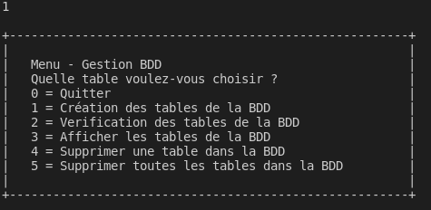

<h1>Projet Furet Du Nord</h1>
<h2>Projet réalisée par Tanguy Ozano et Olivier Lohez</h2>
 
<h2>Sommaire</h2>
<ul>
  <li><a>Présentation du projet</a></li>
  <li><a>Présentation de la structure de données</a></li>
  <li><a>Présentation de la structure du programme</a></li>
  <li><a>Présentation des fonctionnalités du programme</a></li>
  <li><a>Démonstration d'un exemple de fonctionnement</a></li>
</ul>

<h3>Présentation du projet</h3>
 

Notre projet permet d'utiliser une base de données,plus précisément une base de données pour la chaîne de librairie Furet du Nord
Ce projet permet de gérer les auteurs,les éditeurs et les produits
Ce projet rend accessible la gestion des auteurs,éditeurs et des produits de ces bases de données

<h3>Présentation de la structure de données</h3>

<a href="https://github.com/OlivierLohez/FuretDuNord/blob/main/Readmeimages/drive-download-20220407T110644Z-001/Structurededonnées.png">
  

  
  

</a>

Nous avons dans notre programme trois tables composée comme ceci :

  <ul>
      <li>Editeur
      <ul>
        <li>IDEditeur(Clé primaire)
        <li>NomEditeur
        <li>AdresseEditeur
        <li>villeEditeur
      </ul>
      <li>Produit
      <ul>
        <li>IDProduit(Clé primaire)
        <li>nomProduit
        <li>Stock
        <li>DateParution
        <li>Type
        <li>Prix
        <li>IDEditeur(Clé étrangère) 
      </ul>
      <li>Auteur
      <ul>
        <li>IDAuteur(Clé primaire)
        <li>NomAuteur
        <li>PrenomAuteur
      </ul>
  </ul>
   

  
Une quatrième table est présente dans la base de donnée, mais pas dans ne possède pas de fichier propre dans le programme en dart. C'est la table Creer, qui sert de table d'association entre la table Auteur et la table Produit. Chaque produit peut donc avoir plusieurs auteurs et chaque auteur peut avoir fait plusieurs produits.

  <ul>
  <li> Creer
    <ul>
      <li>IDAuteur(Clé primaire étrangère)
      <li>IDProduit(Clé primaire étrangère)
    </ul>
  </ul>
 

  
<h3>Présentation de la structure du programme</h3>
 

Notre projet se compose de plusieurs éléments, répondant aux critères d'un Modèle Vue Contrôleur.

Tout d'abord, commençons par le contrôleur, le fichier "main", qui sert de point de départ et de fin du programme.

Nous avons 4 cerveaux, commençant tous par le suffixe "db_" suivit du contenu avec lequel il interragit, chacun à pour rôle de gérer les requêtes SQL :

- Permettant à l'utilisateur d'agir directement sur le contenu de la base de données. 

- Permettant à l'utilisateur d'agir directement sur le contenu de la table éditeur. 

- Permettant à l'utilisateur d'agir directement sur le contenu de la table auteur. 

- Permettant à l'utilisateur d'agir directement sur le contenu de la table produit. 

 

Les informations extraites par les différentes tables (on ne prend pas en compte la base de données dans son ensemble) sont stockées grâces à des instances de classe. Chacune des classes possède un fichier qui lui est propre à son nom. Une classe abstraite "Data" sert de modèle par défaut pour l'appel et l'affichage des classes "Editeur", "Auteur" et "Produit". Ces trois dernières classes ont leur propres méthodes d'affichage et possèdent plusieurs constructeurs. Les deux plus importants étant le constructeur prenant toutes les données à afficher et le constructeur d'un objet "vide" non null pour empêcher les bugs lors de la récupération de données inexistantes.

 

Enfin, nous avons de nombreux fichiers utilisés pour les vues, commençant tous par le suffixe "ihm_" suivit du nom de leur tableau.

Le fichier "ihm_principal" sert à la fois de premier panneau d'affichage et de stockage de méthode d'affichage réutilisées dans les autres fichiers ihm. Chaque panneau affiché par un ihm permet soit de naviguer vers un autre tableau, soit de faire appel à une méthode du tableau.

Ces méthodes présentent dans les fichiers ihm font appel à leur tour aux méthodes présentent dans leur cerveau associé, qui se connecte à la base de données SQL et envoie sa requête. Il est possible de récupérer grâce à certaines méthodes du cerveau des données (les méthodes dont la signature commence par "select"). Celle-ci sont stockées temporairement dans leur classe respective (Editeur, Auteur ou Produit), pour être restitué à la méthode de la vue qui affiche les les objets reçus.

 

<h3>Présentation des fonctionnalité du programme</h3>
 

Le premier élément à noter est la présence d'un système de vérification de la connexion. Si celle-ci n'est pas possible (c'est-à-dire qu'une première connexion sans requête n'a pas réussie), le programme se ferme directement.

 

Si la connexion a été réussie, un premier panneau s'ouvre. Il suffit de saisir le nombre 0 sur ce panneau pour quitter le programme. Sur tous les autres panneaux, cela permet de revenir au panneau précédent.

Chaque panneau possède 2 types d'actions : la navigation vers de nouvelles options ou une interaction avec la base de données ou une des tables. Si l'on interragit avec une table, l'utilisateur reste sur le même panneau et pourra continuer d'interragir avec cette même table.

 

Les interactions avec la base de données sont : la vérification de la présence de toutes les tables, la création de toutes les tables manquantes, la suppression d'une table spécifique et la suppression de toutes les tables.

 

Les interactions avec la base de données sont : 
  <ul>
    <li>l'ajout d'un nouvel élément
    <li>sa modification
    <li>la suppression d'un ou de tous les élements en fonction d'une condition (présente dans la table ou en interaction directe avec la table)
    <li>l'affichage de tous les éléments répondant à un même critère (de la table même ou en interaction directe avec la table)
  </ul>

L'ajout et la modification d'un produit ou d'un auteur permet de faire apparaître l'option d'associer cet élément avec un élément d'une autre table (produit avec auteur et auteur avec produit), remplissant ainsi une 4e table, la table "CREER". La suppression de l'un ou l'autre de ces éléments débute par la suppression de toutes ses références dans la table CREER, puis de l'élément même.

De la même manière, la suppression d'un éditeur nécessite de supprimer tous les produits associés. Hors, il faut d'abord supprimer ces produits dans la table CREER, pour les effacer dans la table PRODUIT, pour enfin supprimer l'éditeur. Il faudra donc être prudent lors de la suppression d'un éditeur de la base de données.

<h3>Démonstration d'un exemple de fonctionnement</h3>

Après vous avoir expliquez tout ca, une petite démonstration:

Dans notre démonstration,nous allons créer une nouvelle base de données puis créer un éditeur,un produit et un auteur et les afficher

  <h1>Connexion et initialisation de la base de données</h1>
<h4>A l'allumage du programme,il faudra se connecter en indiquant la base de données concernée.Indiquer ensuite l'utilisateur et son mot de passe associé</h4>
<a href="https://github.com/OlivierLohez/FuretDuNord/blob/main/Readmeimages/connexion.png">
  

  
  

</a>
<h4>Nous accèdons au menu principal et nous allons dans notre cas,tapez 1 pour accéder à "Manipuler les BDD" qui nous permettra de créer les tables de base automatiquement</h4> 
<a href="https://github.com/OlivierLohez/FuretDuNord/blob/main/Readmeimages/menuprincipal.png">
  

  
  

</a>
<h4>Nous voila actuellement dans le menu - Gestion BDD et nous allons taper 1 pour la "Création des tables de la BDD"</h4>
<a href="https://github.com/OlivierLohez/FuretDuNord/blob/main/Readmeimages/gestionBDD.png">
  

  
  

</a>
<h4>Voila maintenant nos tables sont crées ce qui nous donne ceci</h4>
<a href="https://github.com/OlivierLohez/FuretDuNord/blob/main/Readmeimages/CreationdestablesBDD.png">
  

  
  

</a>
  <h4>Maintenant,nous allons taper 0 pour "Quitter" et revenir dans le menu principal</h4>
<a href="https://github.com/OlivierLohez/FuretDuNord/blob/main/Readmeimages/menuprincipal2.png">
  

  
  

</a>
  <h1>Création de l'éditeur et vérification</h1>
<h4>Nous sommes de nouveau dans le menu principal,nous allons partir pour créer notre premier Editeur</h4>
<a href="https://github.com/OlivierLohez/FuretDuNord/blob/main/Readmeimages/menuprincipal2.png">
  

  
  

</a>
  <h4>Pour créer notre premier éditeur , nous allons taper 1 pour "Ajouter un éditeur"</h4>
<a href="https://github.com/OlivierLohez/FuretDuNord/blob/main/Readmeimages/menuEditeur.png">
  

  
  

</a>
  <h4>Il ne vous reste qu'à rajouter le nom , ville et adresse que vous voulez saisir</h4>
<a href="https://github.com/OlivierLohez/FuretDuNord/blob/main/Readmeimages/CréationEditeur.png">
  

  
  

</a>
  <h4>Puis nous allons taper 3, pour pouvoir vérifier si notre éditeur à bien était créer</h4>
<a href="https://github.com/OlivierLohez/FuretDuNord/blob/main/Readmeimages/menuEditeur.png">
  

  
  

</a>
<h4>Nous allons afficher tout les éditeurs donc nous allons taper 1 pour "Afficher tout"
<a href="https://github.com/OlivierLohez/FuretDuNord/blob/main/Readmeimages/AffichageEditeur.png">
  

  
  

</a>
<h4>Et voila tout nos editeurs ou plutôt l'éditeur que nous avons créer
<a href="https://github.com/OlivierLohez/FuretDuNord/blob/main/Readmeimages/affichagedesediteur.png">
  

  
  

</a>
<h4>Maintenant nous allons taper 0 puis entrée pour revenir dans le menu puis une autre fois 0 puis entrée pour revenir dans le menu principal
<a href="https://github.com/OlivierLohez/FuretDuNord/blob/main/Readmeimages/retourgestionediteur.png">
  

  
  

</a>
<a href="https://github.com/OlivierLohez/FuretDuNord/blob/main/Readmeimages/retourgestionediteur2.png">
  

  
  

</a>
  <h1>Création du Produit et vérification</h1>
<h4>Nous voilà revenus dans le menu principal, nous allons maintenant créer notre produit et vérifier donc taper 4</h4>
<a href="https://github.com/OlivierLohez/FuretDuNord/blob/main/Readmeimages/menuprincipal2.png">
  

  
  

</a>
  <h4>Ensuite taper 1 pour pouvoir créer votre produit</h4>
<a href="https://github.com/OlivierLohez/FuretDuNord/blob/main/Readmeimages/gestionproduit.png">
  

  
  

</a>
<h4>Rentrez un nom, quantité, date de parution, type(livre,film,etc) , son prix et l'id de l'éditeur associé au produit et on associera un auteur au moment de la création de l'auteur</h4>
<a href="https://github.com/OlivierLohez/FuretDuNord/blob/main/Readmeimages/créationduproduit.png">
  

  
  

</a>
<h4>Pour visualiser nos produits nous allons taper 3 puis entrée et nous sélectionnerons "Afficher tout" donc on tape 1</h4>
<a href="https://github.com/OlivierLohez/FuretDuNord/blob/main/Readmeimages/visualisationdesproduits.png">
  

  
  

</a>
  <h4>Nous retournons ensuite dans le menu principal donc on taper 0 puis entrée et encore une fois, on tape 0 puis entrée</h4>
<a href="https://github.com/OlivierLohez/FuretDuNord/blob/main/Readmeimages/retourmenuprincipal.png">
  

  
  

</a>
  <h1>Création de l'Auteur et Vérification</h1>
  <h4>Pour créer l'Auteur , il faudra taper 2 pour pouvoir créer notre Auteur et le vérifier</h4>
<a href="https://github.com/OlivierLohez/FuretDuNord/blob/main/Readmeimages/menuprincipal2.png">
  

  
  

</a>
<h4>Puis taper 1 pour "Ajouter un auteur" et taper le nom,prénom de l'auteur et à partir de ce moment vous pouvez l'associer au produit que vous avez créer
<a href="https://github.com/OlivierLohez/FuretDuNord/blob/main/Readmeimages/Créationdauteur.png">
  

  
  

</a>
<h4>Puis nous allons taper 3 pour "Afficher un ou plusieurs auteurs" et nous allons taper 1 pour "Afficher tout" pour pouvoir afficher nos auteurs
<a href="https://github.com/OlivierLohez/FuretDuNord/blob/main/Readmeimages/affichageauteur.png">
  

  
  

</a>
  <h1>Comment quitter le programme ?</h1>
  <h4>Pour pouvoir quitter le programme , rien de plus simple , il vous suffit juste d'écrire 0 puis entrée en série jusqu'à que le message "Au revoir , utilisateur!" soit écrit</h4>
<a href="https://github.com/OlivierLohez/FuretDuNord/blob/main/Readmeimages/Quitterfinale1.png">
  

  
  

</a>
<a href="https://github.com/OlivierLohez/FuretDuNord/blob/main/Readmeimages/Quitterfinale2.png">
  

  
  

</a>
 

